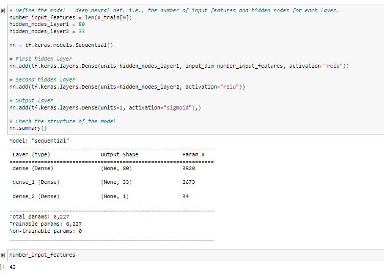
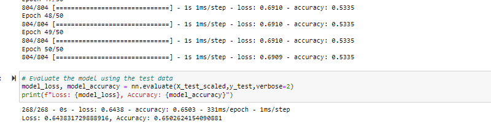
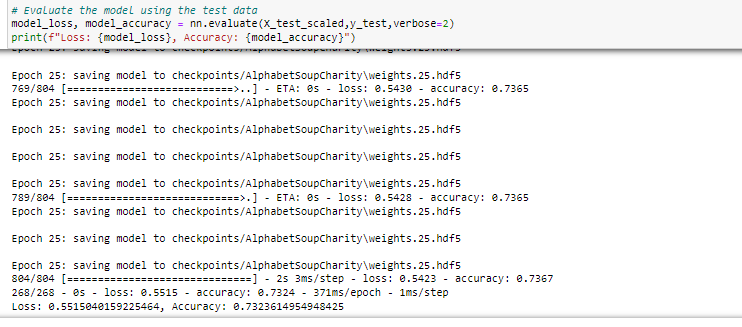
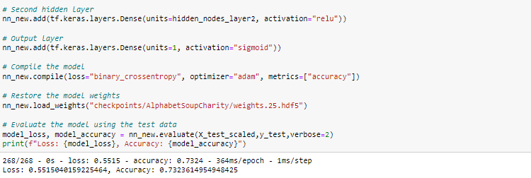
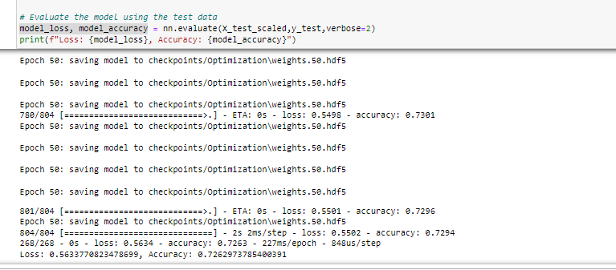

# ** Neural networks and Deep Learning Models**
# **Neural_Network_Charity_Analysis**

## **Overview of the analysis**  

* Beks has come a long way since her first day at that boot camp five years ago and since earlier this week, when she started learning about neural networks! Now, she is finally ready to put her skills to work to help the foundation predict where to make investments.

* With our knowledge of machine learning and neural networks, We will use the features in the provided dataset to help Beks create a binary classifier that is capable of predicting whether applicants will be successful if funded by Alphabet Soup.

* From Alphabet Soup’s business team, Beks received a CSV containing more than 34,000 organizations that have received funding from Alphabet Soup over the years. Within this dataset are a number of columns that capture metadata about each organization.

* This new assignment consists of three technical analysis deliverables and a written report

### Purpose 

* The purpose of the challenge is
	- Preprocessing Data for a Neural Network Model
	- Compile, Train, and Evaluate the Model
	- Optimize the Model
	- A Written Report on the Neural Network Model 

## **Results** 

* Using bulleted lists and images to support your answers, address the following questions.

* Data Preprocessing
- What variable(s) are considered the target(s) for your model?
	- IS_SUCCESSFUL
- What variable(s) are considered to be the features for your model?
	- APPLICATION_TYPE, AFFILIATION, CLASSIFICATION, USE_CASE, ORGANIZATION, STATUS, INCOME_AMT, SPECIAL_CONSIDERATIONS, ASK_AMT
- What variable(s) are neither targets nor features, and should be removed from the input data?
		- EIN and NAME are neither target or features

 ### structure of the model
 

* Compiling, Training, and Evaluating the Model
	- How many neurons, layers, and activation functions did you 	select for your neural network model, and why?
	- 80 for first layer as it should be 2-3 times the input features(43) and 33 the second layer , this combination gave best results
	- 2 hidden layers and one outer layer, relu activation function for first and second layer and sigmoid for the outer layer

	- Were you able to achieve the target model performance?
		- No the model was performing at 72-73% (the target was 75% )
     - What steps did you take to try and increase model performance?
	- removed Noisy variables features 
	- Creating more bins for rare occurrences in columns
	- Increasing the number of values for each bin
	- Adding more neurons to a hidden layer
	- Adding one additional hidden layers
	- changed the activation function of hidden layers is changed for optimization (commented out since did not increase the performance of the model)
	- saved model's weights are saved every 5 epochs
	- adding the number of epochs to the training regimen 

## **Summary** 
### model_loss, model_accuracy

* Summarize the overall results of the deep learning model
	- in the first notebook the model performed was between 65% - 70% as in image above, deponding on what has been changed mainly number of nuerons in the hidden layer and number of epoch to train the model

### model_loss, model_accuracy, check point added

	- when the checkpoints and callback that saves the smodel's weights every 5 epochs are added, the model performance improved to 72-73.5% as in the image above

### model_loss, model_accuracy for Optimized model

	- In the second notebook for optimazation, i have done all the steps mentioned above to improve the performance of the model and yet the performance of the model is 72-73% never improved to the target which is above 75%.

* There is a recommendation on using a different model to solve 
the classification problem, and justification 
	- since the performance of the model did not get to the target 75%, I recommend we use a different model to solve classification problem .SVMs are supervised learning models that analyze data used for regression and classification. In many binary classification problems, SVMs will outperform the basic neural network model, so We will use SVM model and test the performance. Also we have seen in the module the amount of code required to build and train the SVM is notably less than the comparable deep learning model.

	- since the performance of the model did not get to the target 75%, I recommend we use a different model to solve classification problem, the Random forest classifiers model is also another option. The Random forest classifiers are a type of ensemble learning model that combines multiple smaller models into a more robust and accurate model. They are robust and they can easily handle outliers and nonlinear data. since our dataset does not contain images as the Random forest classifiers model handles tabular data. We will train the data with the Random forest model and compare the accuracy with deep learning model. Also the implementation and training times Random forest model is more effient than deep learning model on large tabular datasets.

	